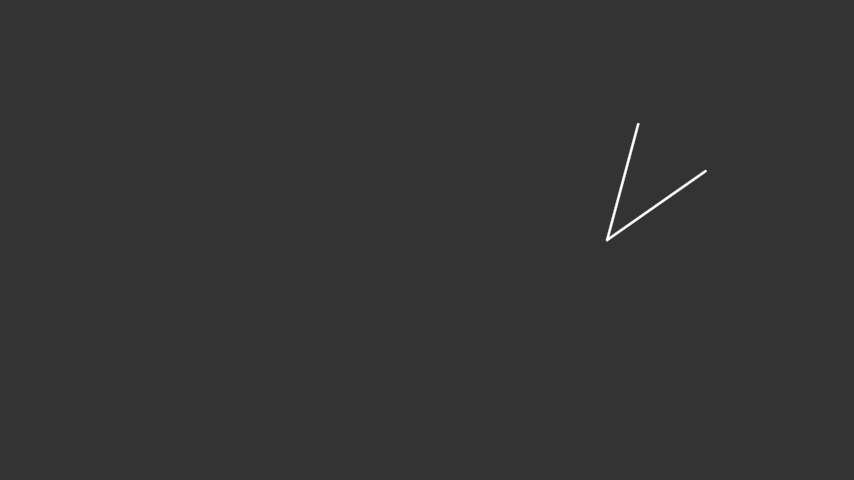

# computer-vision
I love you homies <3

Some library functions aren't allowed, but we could use them temporarily to quickly get a working solution then retroactively replace them with our own implementations.
This would also give us some explar results to regress on later down the line. 

Task1 TODO:
1. store error as a float and see how that changes our total error, I suspect it will lower it significantly
2. Check our canny implementation is correct. from inspecting images it seems the edges are a lot thicker than the OpenCV impl. We think it could be a problem with the non-max suppression.
3. (optional) vectorise canny functions
4. Once canny is definitely working, try finding a good set of parameters for canny. Vectorisation will help this to be plausible. Possible tricks are running it on a reduced dataset and looking up if there exist some standard values used by other people.
5. One paramter we need to better understand is the magnitude interpolation coefficient used in non-max-suppression
6. Check if our strategy of picking lines from the hough space is sound. There will generally be more than one line in the hough space corresponding to a line in the image. At teh moment we pick the largest and smallest values of theta, but does a better strategy exist? Some of this will be addressed by having a better canny edge detection algorithm.
7. The report

### Task 2

1. Data split - I suggest splitting the dataset into a dev/test set in a bid to reduce overfitting. I think overfitting is a real risk because we will be using the same image annotations for both training and evaluation. 
2. Extract templates - Use the provided annotations to identify regions of interest accross the dataset.
3. Scale templates - Generate a number of versions of each template at different scales, this will use a Gaussian pyramid.
4. Refine templates - Use techniques such as normalisation, image flipping, and the addition of noise to templates to improve robustness.
5. Match templates - Run though an image at different resolutions to test against the generated templates.
6. Calculate bounding box - Not sure on this one, I assume we will have access to teh size of teh template that matches and where the match edges are.
7. Post processing - I reckon we will need something like non-max suppression to arbitrate between ovelapping bounding boxes.
8. Evaluate - Use the annotations as a ground truth and use a comparison function to calculate metrics like accuracy, precision, f1, etc.

### Task 3

**Todo:**

1. [x] Implement a feature descriptor matching algorithm.
- E.g., brute force matching using KNN
2. [ ] Implement `RANSAC`

## Running locally
1. Install python etc
2. (Optional) setup venv in '.venv' folder so that jupyter knows it exists
```shell
python3 -m venv .venv
source bin/activate
```

3. Install dependencies
```shell
pip install matplotlib pandas opencv-python scipy
```

1. Run the specified task by providive the correct dataset. E.g. to run task 1
```shell
python main.py --Task1Dataset ./Task1Dataset
```

To run task two:
```shell
time python main.py --Task2Dataset ./Task2Dataset --IconDataset ./IconDataset/
```

## Task 1 
Calculate the (smaller) angle between two lines in a black and white image.

For example, for the image below it should return 40.

